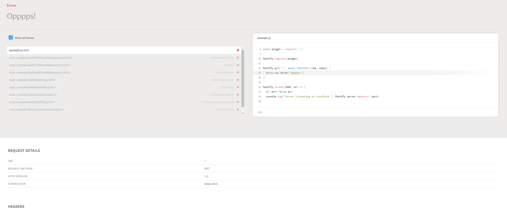

# fastify-error-page
The developer error page - print errors in structured HTML to the browser



## Install
```
npm i fastify-error-page --save
```
## Usage
```js
const fastify = require('fastify')()

if(process.env.NODE_ENV !== 'production') fastify.register(require('fastify-error-page'))

fastify.get('/', async function (req, reply) {
  throw new Error('Opppps!')
})

fastify.listen(3000, err => {
  if (err) throw err
  console.log('Server listenting on localhost:', fastify.server.address().port)
})
```

### Credits

- [youch](https://github.com/poppinss/youch) Pretty error reporting for Node.js 🚀
